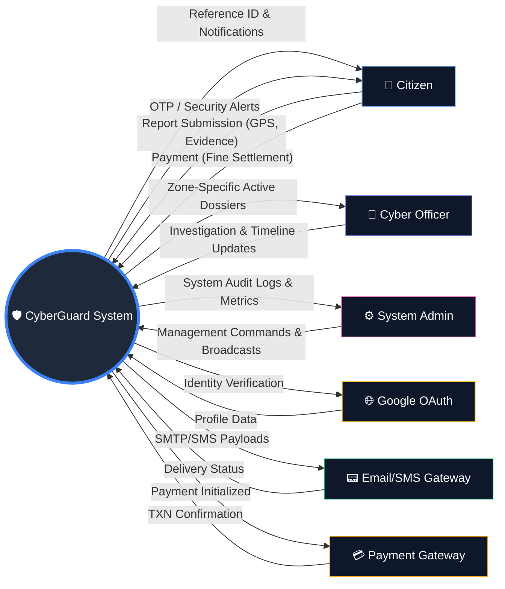

# 📊 Data Flow Diagram (Level 0 - Context Diagram)

The **Level 0 Data Flow Diagram (Context Diagram)** represents the **CyberGuard Infrastructure** as a single central process and its interactions with all external entities. It defines the boundaries of the system and the information exchanged.

---

## 🏗️ Context Diagram (DFD Level 0)

---

## 📊 External Entities: Data Exchange Summary

| External Entity | **Provides to System** (Input Data) | **Receives from System** (Output Data) |
| :--- | :--- | :--- |
| **👤 Citizen** | • Incident Details (Title, Type, Desc) • GPS Coordinates (Lat/Lng) • Attached Evidence (Images/Links) • Login Credentials / OAuth Token | • Unique **Reference ID** for tracking • Real-time Investigation Updates • Security Alert Notifications • Account Access Token |
| **👮 Officer** | • Investigation Progress Notes • Status Transitions (Pending → Resolved) • Identity Verification Checks | • Assigned Case Details (Zone-Specific) • Citizen Contact Metadata (Restricted) • Case Severity Analysis Data |
| **⚙️ Admin** | • Global System Configurations • User Management Commands (Block/Unblock) • Broadcast Alert Content | • Comprehensive **Audit Logs** • System-wide Analytics (Graphs/Stats) • Real-time Resource Metrics |
| **🌐 Google OAuth** | • Verified Identity Profile Data • Unique User Identifier (sub) | • Authentication Handshake Request • App-specific Redirect URI |
| **📟 Email/SMS Gateway** | • Delivery Receipts / Error Codes | • OTP Messages (One-Time Password) • Investigation Update Emails • Security Breach Alerts |
| **💳 Payment Gateway** | • Transaction Success/Failure • Secure Transaction Reference (TXN_ID) | • Payment Amount & User Reference • Secure Checkout Handshake |

---

## 📝 Data Flow Definitions

### 1. Citizen ↔️ System
*   **Incoming**:
    *   **Threat Report**: Details including title, type (Phishing/Malware), description, evidence, and **GPS Coordinates (Latitude/Longitude)**.
    *   **Auth Credentials**: Email/Password for manual login.
*   **Outgoing**:
    *   **Reference ID**: A unique tracking ID generated for every new report.
    *   **Real-time Notifications**: Status changes (e.g., "Investigated") pushed via Socket.io.

### 2. Officer ↔️ System
*   **Incoming**:
    *   **Investigation Notes**: Detailed timeline updates and internal assessment of the threat.
    *   **Status Updates**: Changing the lifecycle of a case (Pending -> Investigating -> Resolved).
*   **Outgoing**:
    *   **Zone-Specific Requests**: Reports auto-assigned based on the **Geo-Zone** of the incident.
    *   **Role-Based Data**: Specific access to restricted citizen metadata for case verification.

### 3. Admin ↔️ System
*   **Incoming**:
    *   **Management Commands**: Blocking/Unblocking accounts, clearing system logs.
    *   **Broadcasts**: Global security warnings sent to all citizen panels.
*   **Outgoing**:
    *   **Live HUD Metrics**: Aggregated data on total cases, active officers, and system health.
    *   **Audit Logs**: Comprehensive records of every action taken by any user in the system.

### 4. External Services (Google Auth)
*   **Incoming**: Verification requests from the backend API.
*   **Outgoing**: Validated profile information (Verified Email, Name, Profile Image) used for automatic citizen registration.

---
*Document Version: 1.0.1 | Generated for CyberGuard Infrastructure Documentation*
