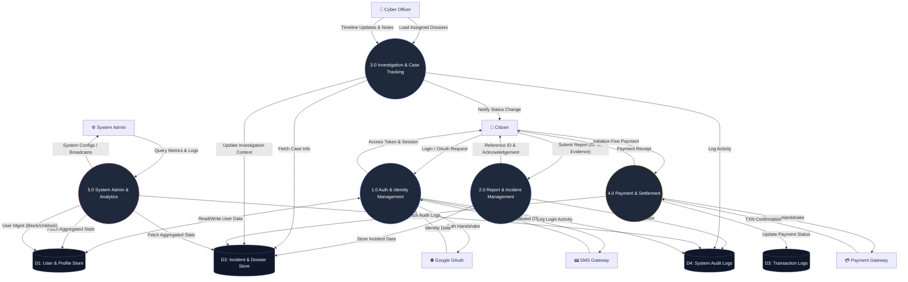

# 📊 Data Flow Diagram (Level 1 - Process Decomposition)

The **Level 1 Data Flow Diagram** breaks down the central **CyberGuard System** into its core functional modules. It illustrates how data moves between specific processes, data stores, and external entities.

---

## 🏗️ Level 1 DFD: System Architecture Decomposition

---

## 🔍 Detailed Module-wise & Process-wise Explanation

This section provides a deep dive into each module, detailing the specific internal processes and how they handle data flow between entities and data stores.

### 🛡️ Module 1.0: Auth & Identity Management
This module is the gateway to the CyberGuard system, ensuring only authorized users have access based on their roles.

*   **Process 1.1: Multi-Channel Login Engine**
    *   **Description**: Manages standard email/password entry and initiates secondary verification factors.
    *   **Input**: User IDs, Passwords (from **Citizen/Officer/Admin**).
    *   **Output**: Verification requests, Login status.
    *   **Data Store**: Queries **D1 (User Store)** for credential matching.

*   **Process 1.2: External Identity Provider (OAuth)**
    *   **Description**: Synchronizes with **Google OAuth** for seamless citizen onboarding.
    *   **Input**: OAuth Token/Callback from **Google OAuth**.
    *   **Output**: Verified Profile Data (Email, Name, Avatar).
    *   **Data Store**: Updates **D1** with social identity markers.

*   **Process 1.3: SMS/Two-Factor verification**
    *   **Description**: Dispatches and verifies security codes for critical actions.
    *   **Input**: Phone numbers, OTP codes.
    *   **Output**: Delivery payloads to **SMS Gateway**, Result status back to user.
    *   **Data Store**: Temporarily holds OTP state in **D1**.

---

### 📑 Module 2.0: Report & Incident Management
The intake module where incidents are digitized and structured for investigation.

*   **Process 2.1: Incident Digitization**
    *   **Description**: Collects and validates raw threat data from the user.
    *   **Input**: Report fields (Title, GPS, Evidence) from **Citizen**.
    *   **Output**: Validation result, UI Feedback.
    *   **Data Store**: Saves the initial record to **D2 (Incident Store)**.

*   **Process 2.2: Reference & Receipt Generation**
    *   **Description**: Generates a unique tracking ID and provides a formal acknowledgement.
    *   **Input**: New Incident ID from **D2**.
    *   **Output**: **Reference ID** sent back to **Citizen**.
    *   **Data Store**: Updates the record in **D2** with the generated reference.

---

### 🕵️ Module 3.0: Investigation & Case Tracking
The primary operational module for officers to manage their workflow.

*   **Process 3.1: Dossier Assignment & Loading**
    *   **Description**: Filters cases based on the officer's assigned zone and jurisdiction.
    *   **Input**: Officer context, Zone parameters.
    *   **Output**: Active case list for the **Officer**.
    *   **Data Store**: Reads from **D2**.

*   **Process 3.2: Timeline & Evidence Management**
    *   **Description**: Tracks the history of the investigation and stores internal notes.
    *   **Input**: Case updates, Status changes from **Officer**.
    *   **Output**: Activity logs.
    *   **Data Store**: Appends progress data to **D2**.

*   **Process 3.3: Real-time Citizen Notification**
    *   **Description**: Pushes updates to the reporting citizen when their case changes state.
    *   **Input**: Trigger from Process 3.2.
    *   **Output**: Alert/Push Notification to **Citizen**.

---

### 💳 Module 4.0: Payment & Settlement
Handles financial transparency for legal settlements within the platform.

*   **Process 4.1: Transaction Initialization**
    *   **Description**: Sets up the secure tunnel for the financial exchange.
    *   **Input**: Intent to pay from **Citizen**.
    *   **Output**: Checkout URL / Session from **Payment Gateway**.

*   **Process 4.2: Settlement Verification**
    *   **Description**: Confirms the receipt of funds and updates the legal status of the case.
    *   **Input**: Webhook/TXN Status from **Payment Gateway**.
    *   **Output**: Receipt.
    *   **Data Store**: Updates **D3 (Transaction Logs)** and **D2** (Status: Settled).

---

### 📊 Module 5.0: System Admin & Analytics
The oversight module for high-level monitoring and governance.

*   **Process 5.1: Analytics Aggregator**
    *   **Description**: Compiles records from all stores to generate health reports.
    *   **Input**: Raw data from **D1, D2, D3**.
    *   **Output**: Visual Charts, KPIs for the **Admin**.

*   **Process 5.2: Governance & Account Control**
    *   **Description**: Direct management of users and system settings.
    *   **Input**: Management commands (Block, Update Roles) from **Admin**.
    *   **Output**: Result acknowledgement.
    *   **Data Store**: Modifies **D1**.

*   **Process 5.3: Global Audit & Logging**
    *   **Description**: Centralizes all security events for compliance.
    *   **Input**: Log streams from all other modules.
    *   **Data Store**: Writes to **D4 (Audit Logs)**.

---

## 📊 Entity-Specific Process Workflows

This section explains the system's operational logic categorized by the primary entities defined in the Level 0 Context Diagram.

---

### 👤 1. Citizen Module (User Workflow)
The Citizen module handles the primary interaction for reporting and tracking.
*   **Registration & Auth**: The citizen interacts with **Process 1.1 & 1.2** to create an identity. Data is verified via **Google OAuth**.
*   **Report Submission**: Interacts with **Process 2.1**. The citizen provides incident metadata (Title, Type, GPS, Evidence).
*   **Tracking & Notifications**: Receives real-time updates from **Process 3.3** whenever an officer updates their case.
*   **Settlement**: Initiates payments via **Process 4.1** for any required legal fees or incident-related settlements.

### 👮 2. Cyber Officer Module (Investigation Workflow)
The Officer module focuses on case resolution and timeline management.
*   **Dossier Management**: Accesses **Process 3.1** to view assigned cases within their specific **Geo-Zone**.
*   **Evidence Review**: Fetches raw report data and attached media from **D2 (Incident Store)** via **Process 3.2**.
*   **Status Transitions**: Updates the lifecycle of a report (e.g., *Under Investigation* → *Resolved*), which triggers the notification engine.
*   **Internal Notes**: Records secure, internal assessment data that is stored in the investigation timeline.

### ⚙️ 3. System Admin Module (Governance Workflow)
The Admin module provides high-level control and system health monitoring.
*   **Access Control**: Uses **Process 5.2** to manage permissions, and block/unblock users in **D1 (User Store)**.
*   **System Analytics**: Monitors KPIs and traffic patterns via **Process 5.1**.
*   **Audit Review**: Accesses **D4 (Audit Logs)** via **Process 5.3** to investigate system-wide actions and maintain security compliance.
*   **Global Broadcasts**: Sends emergency alerts or system maintenance notifications to all active user dashboards.

### 🌐 4. Google Auth Module (External Identity)
Acts as the external trust layer for the system.
*   **Handshake**: Receives authentication requests from **Process 1.2**.
*   **Identity Provision**: Sends back validated profile objects (Verified Email, Full Name) to satisfy registration requirements without manual form entry.

### 📟 5. SMS Gateway Module (Communication)
The utility layer for time-sensitive security and alerts.
*   **OTP Dispatch**: Receives SMS payloads from **Process 1.3** to verify mobile numbers or identity.
*   **Delivery Tracking**: Sends back delivery status codes to ensure the system knows if the user received the critical code.

### 💳 6. Payment Gateway Module (Financial)
The legal bridge for settling financial obligations.
*   **Session Management**: Receives payment intent from **Process 4.1** and renders a secure checkout UI.
*   **TXN Confirmation**: Notifies **Process 4.2** of transaction success/failure via secure webhooks, allowing the system to auto-resolve case-related financial hold status.

---

## 💾 Data Store Definitions

| ID | Name | Description |
| :--- | :--- | :--- |
| **D1** | **User Store** | Registry of all users, hashed passwords, roles, and profile details. |
| **D2** | **Incident Store** | Database containing reports, attached evidence, GPS tags, and investigation timelines. |
| **D3** | **Transaction Logs** | Audit trail of all financial interactions via the Payment Gateway. |
| **D4** | **Audit Logs** | System-wide logs capturing every process execution (Login, Update, Delete). |

---
*Document Version: 1.1.0 | Detailed Process Decomposition for CyberGuard*
