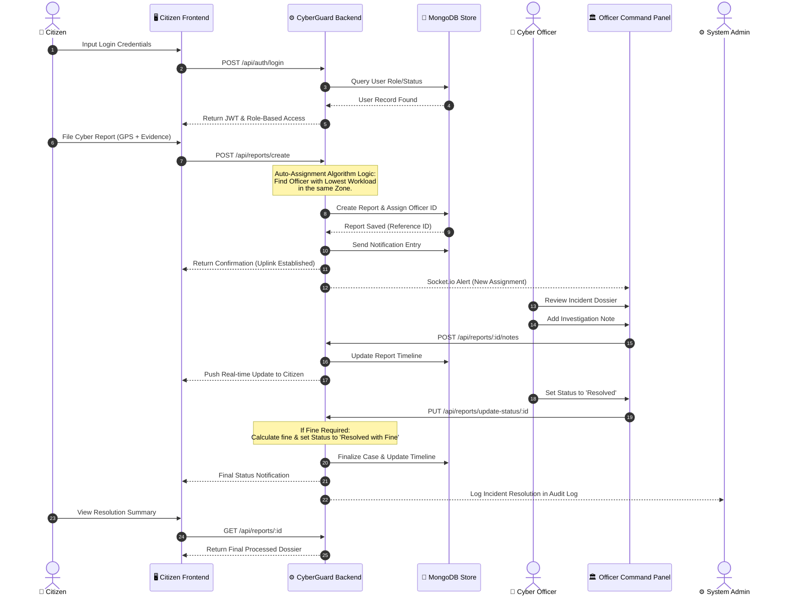

# 🛡️ Sequence Diagram: Incident Reporting Flow

The **Sequence Diagram** illustrates the end-to-end operational flow between all actors (Citizen, Officer, and Admin) and the internal backend services (Database and Notification Engine).

---

## 🏗️ End-to-End Sequence (Threat Lifecycle)

---

## 🔍 Flow Breakdown

### 1. **Authentication (Uplink)**
The citizen must establish a secure session with a valid JWT (JSON Web Token). The system enforces that roles (Citizen, Officer, Admin) are strictly separated.

### 2. **Submission & Intelligent Assignment**
When the report is created, the system doesn't just store it:
*   It captures the **IP Address** and **GPS coordinates**.
*   It immediately runs the **Auto-Assignment Logic**, which finds the Officer with the **lowest current workload** (fewest active reports) in the citizen's specific geographical zone.

### 3. **Investigation & Real-time Sync**
Any note added by the officer is immediately "broadcasted" via the **Notification Engine**. The Citizen's dashboard updates in real-time using Socket.io, eliminating the need to refresh the page.

### 4. **Administrative Audit**
Every status transition is logged. If an officer resolves a case, the system notifies the Admin, ensuring high-level quality control and accountability.

---
*Document Version: 1.0.0 | Generated for CyberGuard Infrastructure Documentation*
