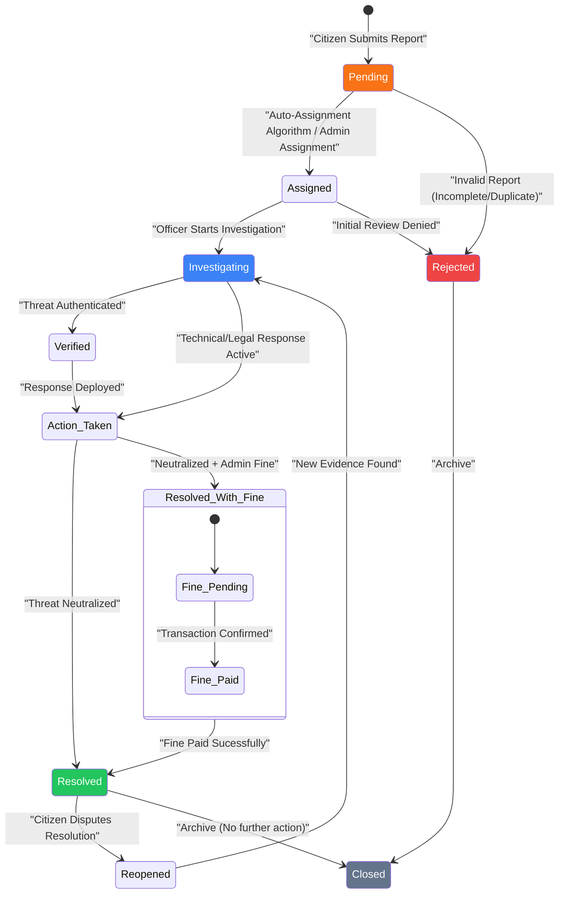

# 🔄 Report State Transition Diagram

The **State Transition Diagram** represents the lifecycle of a **Cyber Threat Report** as it moves through various operational statuses within the CyberGuard ecosystem.

---

## 🏗️ State Machine (Report Status)

---

## 📝 Status Definitions

### 1. **Pending**
The initial entry state. The report has been received but not yet assigned to a specific officer for a formal review.

### 2. **Assigned**
The report is tied to a specific Officer's ID. This triggers a notification to the officer to begin their review.

### 3. **Investigating (Active)**
The officer is actively looking into the case. During this state, investigation notes are added to the official timeline, and a chat channel may be opened with the citizen.

### 4. **Verified / Action Taken**
The threat has been confirmed as real. The officer has initiated technical (e.g., blocking a phishing site) or legal protocols.

### 5. **Resolved / Resolved with Fine**
The official conclusion of a case. The threat no longer presents a danger. If a fine is issued, the case remains in a 'Pending Payment' state until the citizen completes the transaction.

### 6. **Rejected**
The report was determined to be out of scope, a duplicate, or lacked sufficient evidence to proceed.

### 7. **Reopened**
A unique state triggered only by the Citizen if they feel the threat persists after the officer has marked it as Resolved.

---
*Document Version: 1.0.0 | Generated for CyberGuard Infrastructure Documentation*
