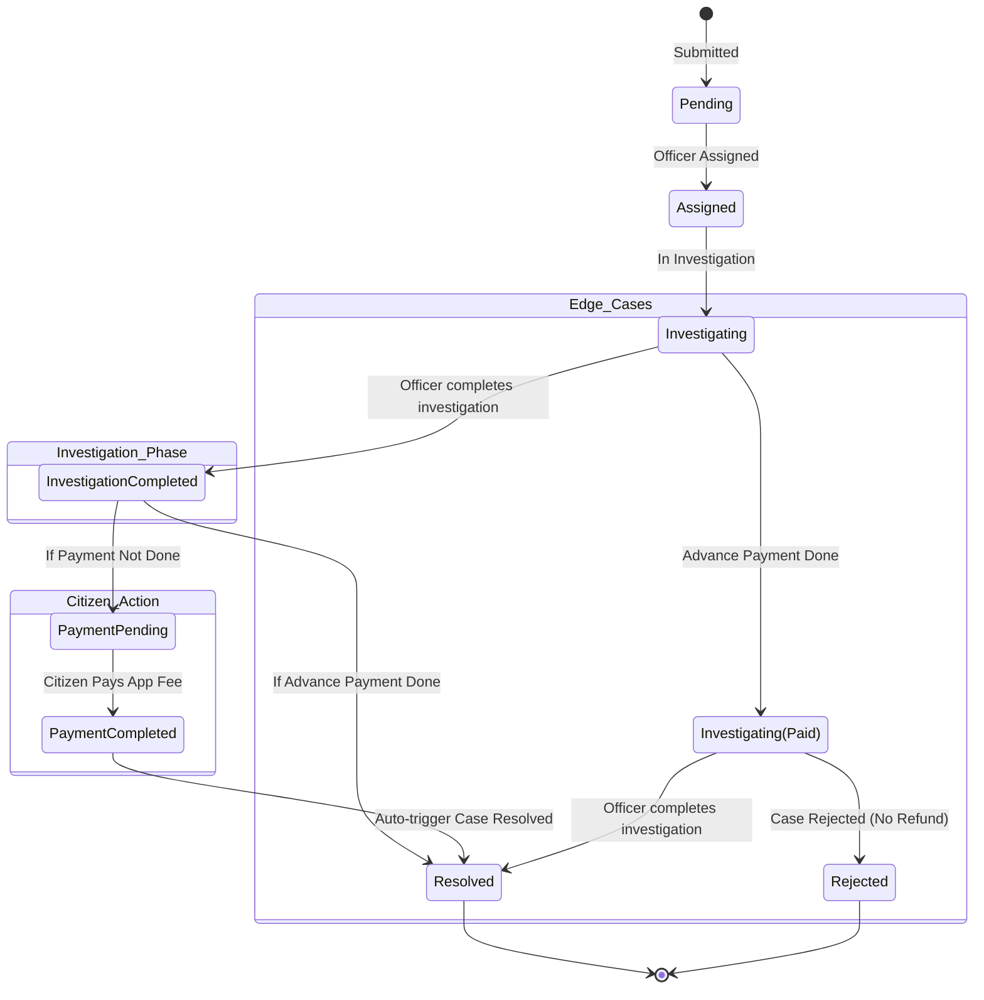

# Case Resolution & Payment Status Flow

This document illustrates the flow of a case through the payment-based resolution system.

## Status Flow Diagram

## Description of Logical Guardrails

1. **Resolution Blocker**: The system backend actively blocks manual updates to the `Resolved` status unless `paymentStatus === 'Completed'`.
2. **Auto-Resolution**: When the payment successfully processes via the Secure Gateway, the system checks if the case is in `Payment Pending`. If so, it instantly escalates the status to `Resolved` and decreases officer workload.
3. **Investigation Completed**: When the officer marks the status as `Investigation Completed`, they define the `paymentAmount`. The system then conditionally halts at `Payment Pending` or jumps to `Resolved` based on the current financial ledger.
4. **Advance Payments (Edge Case)**: If an API-driven advance payment occurs while the case is still `Investigating`, the payment is processed and locked in. If the officer rejects the case later, the payment schema provides no refund fallback, securing the edge case safely.
