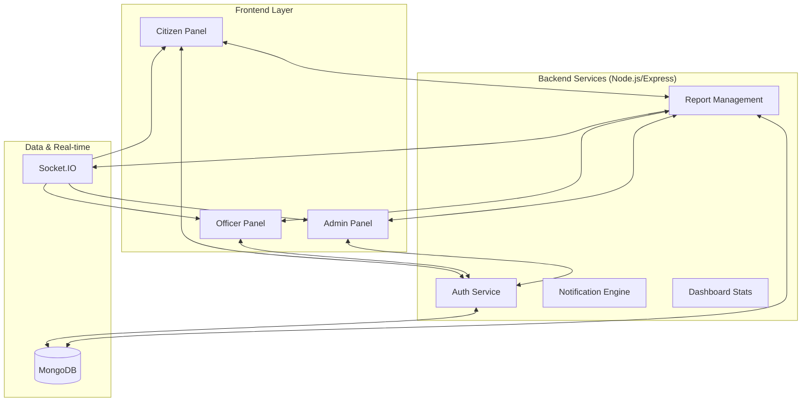

# 🛡️ CyberGuard: System Infrastructure Overview

CyberGuard is a high-security, role-based Cyber Threat Reporting & Monitoring System designed to bridge the gap between citizens, law enforcement (Officers), and system administrators.

---

## 🏗️ System Architecture

---

## 🚀 Key Features

### 1. Advanced Authentication System
- **Multi-Role Support**: Strict isolation between `Citizen`, `Officer`, and `Admin` domains.
- **Citizen OAuth**: Seamless Google Sign-In for citizens (Auto-registration).
- **Direct Entry**: Removed email verification for signup to ensure immediate threat reporting capability.
- **Secure Password Reset**: 3-step OTP-based flow (Email/SMS) with 5-minute expiry.
- **Login Security**: Automated security alerts sent to registered devices upon access.

### 2. Citizen Portal
- **Threat Reporting**: File reports for Phishing, Malware, Fraud, and more.
- **Live Tracking**: Real-time status updates on filed cases via Reference IDs.
- **Evidence Management**: Upload screenshots and documentation securely.
- **Status Dashboard**: Visual summary of personal report history.

### 3. Officer Command Center
- **Case Management**: Access reports assigned for investigation.
- **Threat Assessment**: Verify and escalate severity levels (Low to Critical).
- **Timeline Tracking**: Maintain a detailed audit trail of investigation steps.
- **Community Broadcast**: Send urgent security warnings to all citizens.

### 4. Admin Infrastructure
- **System Oversight**: Real-time monitoring of system-wide cyber activity.
- **Citizen Management**: Ability to block/unblock accounts for security.
- **Full Audit Logs**: Trace every action taken within the infrastructure.
- **Global Broadcasts**: Direct communication channel to all platform users.

---

## 🔄 System Flow

### A. The Incident Reporting Flow
1. **Citizen** identifies a threat and logs into the Citizen Panel.
2. Submits a **Report** with details, severity, and evidence.
3. System generates a **Reference ID** and notifies the Admin.
4. **Admin** reviews the report and assigns it to a **Cyber Officer**.
5. **Officer** updates status (Investigating -> Resolved) and adds timeline notes.
6. **Citizen** receives real-time notifications about their report progress.

### B. The Security Workflow
- **On Login**: System checks role and status (Active/Blocked).
- **On Auth**: Backend generates a 30-day JWT token stored in local storage.
- **On Dashboard**: Dynamic analytics are fetched based on the user's specific role.

---

## 🛠️ Technical Stack

- **Frontend**: React.js with Tailwind CSS & Lucide React.
- **Backend**: Node.js & Express.
- **Database**: MongoDB (NoSQL) for flexible schema reporting.
- **Real-time**: Socket.IO for instant alerts and messages.
- **Authentication**: JWT (JSON Web Tokens) & Google OAuth 2.0.

---

## 📑 API Reference (Core)

| Endpoint | Method | Access | Description |
| :--- | :--- | :--- | :--- |
| `/api/auth/login` | POST | Public | Authenticates user & returns role-based token |
| `/api/auth/google` | POST | Public | Google OAuth login/auto-signup for citizens |
| `/api/reports/create` | POST | Citizen | Submit a new cyber threat report |
| `/api/admin/users` | GET | Admin | Retrieve all registered citizens |
| `/api/dashboard/stats` | GET | All | Role-specific analytics and metrics |

---
*Document Generated: 2026-02-26*
